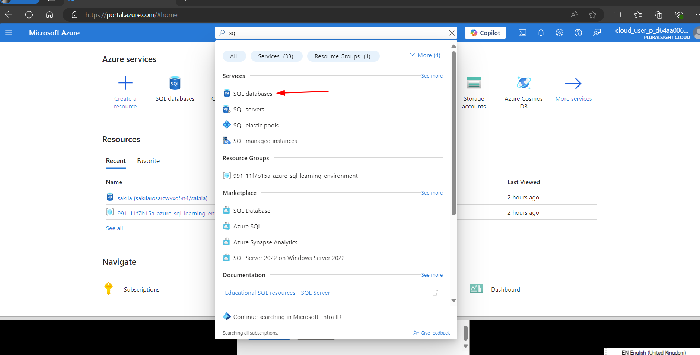
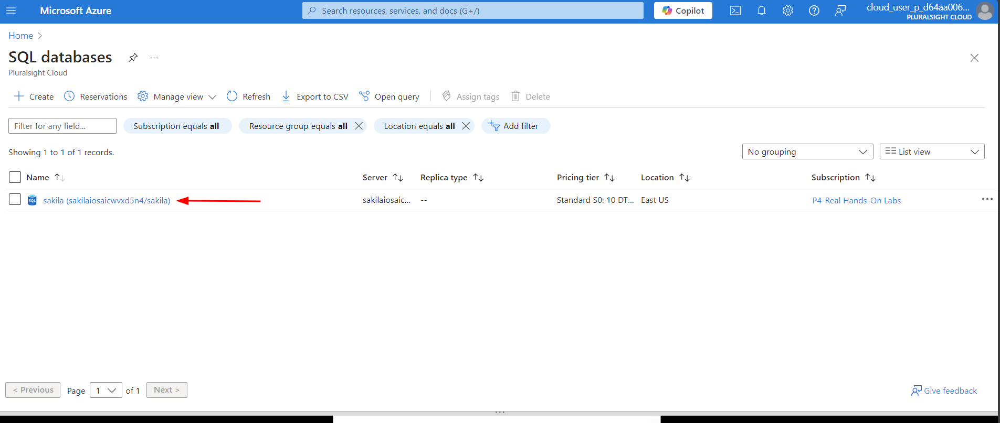
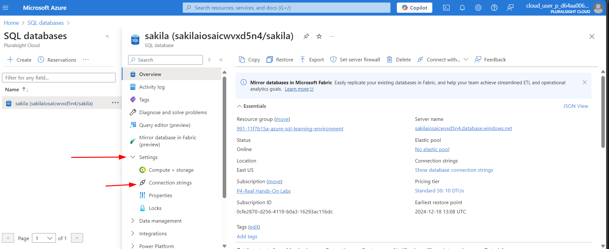
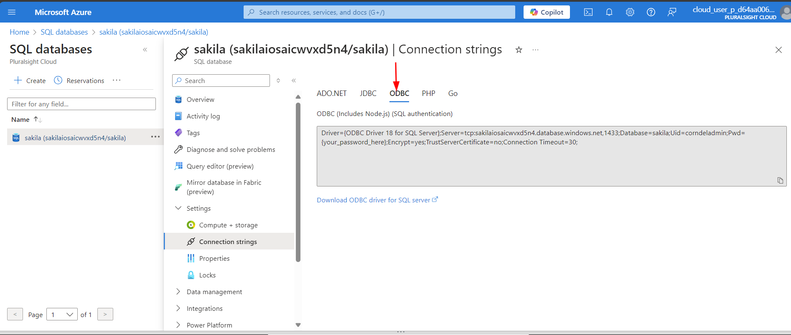
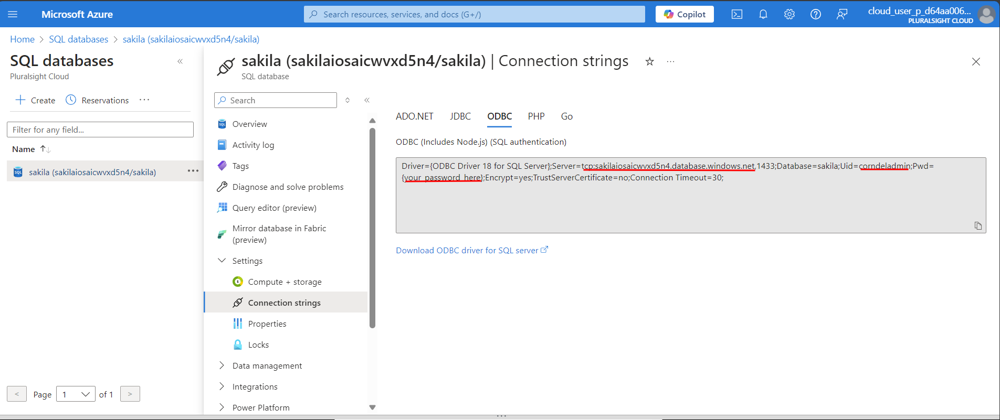

# Connecting to SQL Database using `pyodbc` Library in Python


This notebook is a step-by-step guide to help you learn how to use Python functions and libraries to connect to an SQL database using the `pyodbc` library. Each section of the notebook includes an explanation of the code, which you can run in order to understand the workflow step by step.

## Preparing the SQL Database

Before using Python, we need to decide which SQL database to connect to. For this exercise, we will use the A Cloud Guru (ACG) sandbox to create an SQL database. Once the database is set up, we will obtain the necessary credentials to connect to it using Python. 

A detailed guide on how to create the SQL database in the ACG sandbox is available in a GitHub repository called [DE-sql-learning-environment-Azure](https://github.com/Corndel/DE-sql-learning-environment-Azure). 

Following the instructions provided in the repository from step **1 Create the ACG Sandbox for SQL learning** to step **4 Create tables in Azure SQL database and insert data**, by the completion of which you will have created an SQL database called **sakila**. We will need the **connection strings** for this database in order to be able to connect to it using Python library `pyodbc`. 

## Steps to Acquire the Connection Strings
- Visit the SQL databases in the Azure portal (you can search for this service using the search box at the top and type SQL).



- In the list of databases that appears, click on the single database **sakila (sakilayaq6nqkx2fcqo/sakila)**.



- Click on **Settings** and then on **Connection Strings** in the drop down menu.



- Go to the `ODBC`tab to see the connection string.



- You will need to copy the underlined parts of the **Connection String** and store it somewhere safely to be used when running the pipeline.



- Note that the password *{your_password_here}* is a placeholder within the connection strings, which needs to be replaced with the actual password of the database.

- When running the pipeline you will be prompted to enter these three pieces of information:

    * Server name (the longest underlined part in the above screenshot, which you will be different every time you create sakila). 
    * Username which for this database is **corndeladmin**.
    * Passoword, which is **Password01**.

## Connecting to the **Sakila** Database and Creating an ETL Pipeline

This guide will walk you through the steps (using the `pyodbc` library) to connect to the SQL database we have just created. You will learn how to extract data from the database, manage tables within it, and write the processed data back into the database. Follow each step carefully to gain a clear understanding of how to build an ETL pipeline when you are using Python to work with SQL databases on virtual machines or on remote platforms online.

### The Python Libraries

#### 1. `pyodbc`
It is a Python library for connecting to SQL databases using ODBC drivers. It allows communication between Python and SQL databases, making it essential for running SQL queries and managing database connections.

---

#### 2. `pandas`
This is a Python library for data manipulation and analysis. It provides powerful tools to handle tabular data, such as reading, writing, and processing datasets extracted from the database.

---

#### 3. `os`
This is a standard Python library for interacting with the operating system. It enables tasks like file and directory manipulation, crucial for managing input/output files during the ETL process.

---

#### 4. `shutil`
It is a standard Python library for high-level file operations. It helps in efficiently clearing or organising folders by removing directories and their contents.

---

#### 5. `logging`
This library is used for tracking events during code execution. It provides detailed logs for debugging and monitoring the ETL pipeline, ensuring transparency and easier troubleshooting.

---

#### 6. `getpass`
The `getpass` library in Python securely prompts the user for sensitive information, such as passwords, without displaying the input on the screen. It is ideal for creating secure, interactive command-line applications.

Let's run the following cell to import all of these libraries.


## Connecting to the **Sakila** Database and Creating an ETL Pipeline

This guide will walk you through the steps (using the `pyodbc` library) to connect to the SQL database we have just created. You will learn how to extract data from the database, manage tables within it, and write the processed data back into the database. Follow each step carefully to gain a clear understanding of how to build an ETL pipeline when you are using Python to work with SQL databases on virtual machines or on remote platforms online.


### The Python Libraries

#### 1. `pyodbc`
It is a Python library for connecting to SQL databases using ODBC drivers. It allows communication between Python and SQL databases, making it essential for running SQL queries and managing database connections.

---

#### 2. `pandas`
This is a Python library for data manipulation and analysis. It provides powerful tools to handle tabular data, such as reading, writing, and processing datasets extracted from the database.

---

#### 3. `os`
This is a standard Python library for interacting with the operating system. It enables tasks like file and directory manipulation, crucial for managing input/output files during the ETL process.

---

#### 4. `shutil`
It is a standard Python library for high-level file operations. It helps in efficiently clearing or organising folders by removing directories and their contents.

---

#### 5. `logging`
This library is used for tracking events during code execution. It provides detailed logs for debugging and monitoring the ETL pipeline, ensuring transparency and easier troubleshooting.

#### 5. `getpass`
The `getpass` library in Python securely prompts the user for sensitive information, such as passwords, without displaying the input on the screen. It is ideal for creating secure, interactive command-line applications.

Let's run the following cell to import all of these libraries.


```python
import pyodbc
import pandas as pd
import os
import shutil
import logging
import getpass
```

This code in the next cell uses the `logging` library to set up logging for the ETL pipeline to track events and errors. It writes logs to a file named `etl_pipeline.log` and displays them on the console. The log messages include the time, log level, and the message for clear and detailed tracking of the pipeline’s progress.


```python
logging.basicConfig(level=logging.INFO, 
                    format='%(asctime)s - %(levelname)s - %(message)s',
                    handlers=[
                        logging.FileHandler("etl_pipeline.log"),
                        logging.StreamHandler()
                    ])
```

#### Function: `clear_folder`

This function removes all files and subdirectories within a specified folder. It iterates through each item in the folder, deleting files, symbolic links, and entire directories as needed. The process is logged for transparency, with messages indicating when the operation starts, completes, or encounters an error. This function is particularly useful for ensuring a clean workspace before running an ETL pipeline or similar processes. We will use this function to ensure that our target folder is cleared before the ETL output is written into it. Our target folder for this function is called `reports`, which will be used when we run the pipeline.


```python
def clear_folder(folder_path):
    logging.info(f"Starting to clear the contents of folder: {folder_path}")
    try:
        for item in os.listdir(folder_path):
            item_path = os.path.join(folder_path, item)
            if os.path.isfile(item_path) or os.path.islink(item_path):
                os.unlink(item_path)
            elif os.path.isdir(item_path):
                shutil.rmtree(item_path)
        logging.info(f"Contents of folder {folder_path} have been cleared.")
    except Exception as e:
        logging.error(f"Error while clearing folder {folder_path}: {e}")

```

#### Function: `manage_tables`
The `manage_tables` function is responsible for resetting the structure of specific database tables. It connects to the database using the provided connection string and executes SQL scripts to drop existing tables (`payment_summary_table` and `duration_summary_table`) and recreate them. The function reads the SQL commands from files located in the `queries` folder, ensuring the database is prepared for new data. It handles errors, such as database connection issues or missing SQL files, and logs the process for transparency and troubleshooting.


```python
def manage_tables(connection_string):
    logging.info("Starting to manage tables in the database.")
    try:
        connection = pyodbc.connect(connection_string)
        cursor = connection.cursor()

        # Paths to the SQL files
        drop_payment_table_file = os.path.join('sqlFiles/tableManagement', 'drop_payment_summary_table.sql')
        drop_duration_table_file = os.path.join('sqlFiles/tableManagement', 'drop_duration_summary_table.sql')
        drop_profitable_table_file = os.path.join('sqlFiles/tableManagement','drop_profitable_actors_table.sql')
        create_payment_table_file = os.path.join('sqlFiles/tableManagement', 'create_payment_summary_table.sql')
        create_duration_table_file = os.path.join('sqlFiles/tableManagement', 'create_duration_summary_table.sql')
        create_profitable_actors_table_file = os.path.join('sqlFiles/tableManagement','create_profitable_actors_table.sql')

        # Helper function to execute SQL files
        def execute_sql_file(file_path):
            with open(file_path, 'r') as file:
                sql = file.read()
                cursor.execute(sql)

        # Execute drop table SQL files
        execute_sql_file(drop_payment_table_file)
        execute_sql_file(drop_duration_table_file)
        execute_sql_file(drop_profitable_table_file)
        connection.commit()

        # Execute create table SQL files
        execute_sql_file(create_payment_table_file)
        execute_sql_file(create_duration_table_file)
        execute_sql_file(create_profitable_actors_table_file)
        connection.commit()

        logging.info("Tables:\n\n                                         payment_summary_table\n"         
                     "                                         duration_summary_table\n"
                     "                                         profitable_actors_table \n\n"
                     "                                 have been recreated in the database.")
    except pyodbc.Error as e:
        logging.error(f"Error managing tables: {e}")
    except FileNotFoundError as e:
        logging.error(f"SQL file not found: {e}")
    finally:
        if 'connection' in locals() and connection:
            connection.close()
```

#### Function: `calculate_payments`
The `calculate_payments` function reads an SQL query from a specified file, executes it on a database, and retrieves the results as a pandas DataFrame. The function connects to the database using a given connection string and processes the query to calculate a payments summary, including columns such as `Records`, `Minimum`, `Maximum`, `Total`, and `Average`. It logs progress and errors for transparency and closes the database connection after execution. The result is returned as a structured DataFrame for further analysis.


```python
def calculate_payments(sql_file_path, connection_string):
    logging.info("Starting to calculate payments summary.")
    try:
        connection = pyodbc.connect(connection_string)
        cursor = connection.cursor()
        with open(sql_file_path, 'r') as file:
            sql_query = file.read()
        cursor.execute(sql_query)
        rows = cursor.fetchall()
        payments_summary = pd.DataFrame((tuple(t) for t in rows)) 
        payments_summary.columns = ['Records', 'Minimum', 'Maximum', 'Total', 'Average']
        logging.info("Payments summary successfully retrieved.")
    except pyodbc.Error as e:
        logging.error(f"Error executing payments query: {e}")
    finally:
        if 'connection' in locals() and connection:
            connection.close()
    return payments_summary
```


#### Function: `calculate_duration`

This function retrieves a summary of film durations from an SQL database by executing a query provided in an external SQL file. It connects to the database using the given connection string, reads the query from the specified file, and runs it. The results are then stored in a pandas DataFrame with columns: `Minimum`, `Maximum`, `Total`, and `Average`. Finally, it logs the process and ensures the database connection is closed.


```python
def calculate_duration(sql_file_path, connection_string):
    logging.info("Starting to calculate duration summary.")
    try:
        connection = pyodbc.connect(connection_string)
        cursor = connection.cursor()
        with open(sql_file_path, 'r') as file:
            sql_query = file.read()
        cursor.execute(sql_query)
        rows = cursor.fetchall()
        duration_summary = pd.DataFrame((tuple(t) for t in rows)) 
        duration_summary.columns = ['Minimum', 'Maximum', 'Total', 'Average']
        logging.info("Duration summary successfully retrieved.")
    except pyodbc.Error as e:
        logging.error(f"Error executing duration query: {e}")
    finally:
        if 'connection' in locals() and connection:
            connection.close()
    return duration_summary
```

#### Function: `calculate_profitable_actors`

The `calculate_profitable_actors` function retrieves a list of the most profitable actors from a database based on an SQL query. It connects to the database using the provided connection string, reads the SQL query from a file, and executes it to fetch the results. These results are converted into a pandas DataFrame with clear column names: `ActorID`, `FirstName`, `LastName`, and `TotalSale`. The function includes error handling to log any issues and ensures the database connection is closed afterwards to manage resources efficiently. This function is a great way for learners to experiment with combining Python, SQL, and pandas to process and analyse data effectively.


```python

def calculate_profitable_actors(sql_file_path, connection_string):
    logging.info("Starting to calculate profitable actors.")
    try:
        connection = pyodbc.connect(connection_string)
        cursor = connection.cursor()
        with open(sql_file_path, 'r') as file:
            sql_query = file.read()
        cursor.execute(sql_query)
        rows = cursor.fetchall()
        profitable_actors = pd.DataFrame((tuple(t) for t in rows)) 
        profitable_actors.columns = ['ActorID', 'FirstName', 'LastName', 'TotalSale']
        logging.info("Profitable actors successfully retrieved.")
    except pyodbc.Error as e:
        logging.error(f"Error executing duration query: {e}")
    finally:
        if 'connection' in locals() and connection:
            connection.close()
    return profitable_actors
```

#### Function: `write_dataframe_to_db`

The `write_dataframe_to_db` function inserts the rows of a pandas DataFrame into a specified SQL database table. It connects to the database using the provided connection string, then iterates through each row of the DataFrame and executes an SQL `INSERT` statement to write the data. The function dynamically matches column names and values using placeholders to ensure compatibility. It also handles errors gracefully by logging issues and ensuring the database connection is properly closed after the operation.


```python
def write_dataframe_to_db(dataframe, table_name, connection_string):
    logging.info(f"Starting to write DataFrame to table: {table_name}")
    try:
        connection = pyodbc.connect(connection_string)
        cursor = connection.cursor()
        # Insert rows into the database
        for index, row in dataframe.iterrows():
            placeholders = ', '.join(['?'] * len(row))
            columns = ', '.join(dataframe.columns)
            sql = f"INSERT INTO {table_name} ({columns}) VALUES ({placeholders})"
            cursor.execute(sql, tuple(row))
        connection.commit()
        logging.info(f"Data successfully written to table: {table_name}.")
    except pyodbc.Error as e:
        logging.error(f"Error writing to database table {table_name}: {e}")
    finally:
        if 'connection' in locals() and connection:
            connection.close()
```

#### Function: `write_local_txt_output`

This function saves the contents of a pandas DataFrame as a tab-separated text file in a specified folder. It first ensures the folder exists (creating it if necessary), then writes the DataFrame to a file with the given name. The file does not include row indices, making it cleaner for sharing or further processing. If successful, the function logs the file’s location and returns its path. In case of an error, it logs the issue and returns `None`, ensuring clear feedback for troubleshooting.


```python
def write_local_txt_output(dataframe, folder_path, file_name):
    logging.info(f"Starting to write DataFrame to text file: {file_name}")
    try:
        os.makedirs(folder_path, exist_ok=True)
        file_path = os.path.join(folder_path, file_name)
        dataframe.to_csv(file_path, sep='\t', index=False)
        logging.info(f"Processed data successfully written to {file_path}")
        return file_path
    except Exception as e:
        logging.error(f"An error occurred while writing to text file {file_name}: {e}")
        return None
```

#### Running the pipeline

This section of the code serves as the entry point for the script. It begins by prompting the user to provide the SQL Server address, username, and password, ensuring secure input for the connection. A connection string is then constructed to establish communication with the `sakila` database using the specified SQL Server. The script prepares a target folder (`reports`) by clearing any existing content and processes the database tables using custom queries.

It performs the following tasks:
1. Executes the SQL query for payments and calculates summary data.
2. Executes the SQL query for film durations and calculates summary data.
3. Executes the SQL query for profitable actors and calculates a table of the most profitable actors.
4. Saves the results into three summary tables in the database: `payment_summary_table`, `duration_summary_table`, and `profitable_actors_table`.
5. Exports also the same results into local `.txt` files, stored in the `reports` folder.

The pipeline ensures that all relevant data is processed, stored, and made accessible for further use.


```python
if __name__ == "__main__":
    server = input("Please enter the SQL Server address (hint: starts with tcp and ends with .net): ").strip()
    username = input("Please enter your Username:").strip()
    password = getpass.getpass("Please enter your Password: ").strip()
    connection_string =   str(
    f"Driver={{ODBC Driver 18 for SQL Server}};"
    f"Server={server},1433;"
    f"Database=sakila;"
    f"Uid={username};"
    f"Pwd={password};"
    f"Encrypt=yes;TrustServerCertificate=no;Connection Timeout=30;"
)
    target_folder = "reports"

    clear_folder(target_folder)
    manage_tables(connection_string)
    payments_df = calculate_payments("sqlFiles/queries/payments.sql", connection_string)
    duration_df = calculate_duration("sqlFiles/queries/filmduration.sql", connection_string)
    profitable_actors_df = calculate_profitable_actors("sqlFiles/queries/profitable_actors.sql", connection_string)

    write_dataframe_to_db(payments_df, "payment_summary_table", connection_string)
    write_dataframe_to_db(duration_df, "duration_summary_table", connection_string)
    write_dataframe_to_db(profitable_actors_df,"profitable_actors_table", connection_string)

    write_local_txt_output(payments_df, "reports", "payment_summary.txt")
    write_local_txt_output(duration_df, "reports", "duration_summary.txt")
    write_local_txt_output(profitable_actors_df, "reports", "profitable_actors.txt")
```

    2024-12-20 10:39:40,053 - INFO - Starting to clear the contents of folder: reports
    2024-12-20 10:39:40,074 - INFO - Contents of folder reports have been cleared.
    2024-12-20 10:39:40,077 - INFO - Starting to manage tables in the database.
    2024-12-20 10:39:44,147 - INFO - Tables:
    
                                             payment_summary_table
                                             duration_summary_table
                                             profitable_actors_table 
    
                                     have been recreated in the database.
    2024-12-20 10:39:44,150 - INFO - Starting to calculate payments summary.
    2024-12-20 10:39:45,692 - INFO - Payments summary successfully retrieved.
    2024-12-20 10:39:45,908 - INFO - Starting to calculate duration summary.
    2024-12-20 10:39:47,518 - INFO - Duration summary successfully retrieved.
    2024-12-20 10:39:47,736 - INFO - Starting to calculate profitable actors.
    2024-12-20 10:39:49,922 - INFO - Profitable actors successfully retrieved.
    2024-12-20 10:39:50,135 - INFO - Starting to write DataFrame to table: payment_summary_table
    2024-12-20 10:39:51,952 - INFO - Data successfully written to table: payment_summary_table.
    2024-12-20 10:39:51,955 - INFO - Starting to write DataFrame to table: duration_summary_table
    2024-12-20 10:39:53,782 - INFO - Data successfully written to table: duration_summary_table.
    2024-12-20 10:39:53,786 - INFO - Starting to write DataFrame to table: profitable_actors_table
    2024-12-20 10:40:39,077 - INFO - Data successfully written to table: profitable_actors_table.
    2024-12-20 10:40:39,080 - INFO - Starting to write DataFrame to text file: payment_summary.txt
    2024-12-20 10:40:39,099 - INFO - Processed data successfully written to reports/payment_summary.txt
    2024-12-20 10:40:39,102 - INFO - Starting to write DataFrame to text file: duration_summary.txt
    2024-12-20 10:40:39,122 - INFO - Processed data successfully written to reports/duration_summary.txt
    2024-12-20 10:40:39,126 - INFO - Starting to write DataFrame to text file: profitable_actors.txt
    2024-12-20 10:40:39,146 - INFO - Processed data successfully written to reports/profitable_actors.txt


# Scenario Based Exercise
You have been provided this repository and the following SQL query. You have been asked to embed this query as an additional functionality into the pipeline and automate its execution each time the pipeline is run. Note that you will need to create the required SQL files for clearing a table (if it exists), creating a table with appropriate name, and one SQL file containing the query that is provided. You will need to place these SQL files in the correct folders within the `sqlFiles` directory. Additionally you will need to create a new function into the pipeline to correctly execute the given query and automate the output by writing a table of the results into the database and a `.txt` of the same results into the reports folder locally.

The query basically retrieves a table of table of film sales, and add a rank column (rk) based on which film has the most sales. The output of the query is a table with three columns namely `film_id`, `sales`, and `rk`.

```SQL
WITH film_sales AS (
    SELECT 
        f.film_id, 
        SUM(p.amount) AS sales
    FROM 
        film f
    INNER JOIN inventory i ON f.film_id = i.film_id
    INNER JOIN rental r ON i.inventory_id = r.inventory_id
    INNER JOIN payment p ON r.rental_id = p.rental_id
    GROUP BY 
        f.film_id
)

SELECT 
    a.film_id, 
    a.sales, 
    COUNT(b.film_id) + 1 AS rk
FROM 
    film_sales a
LEFT JOIN 
    film_sales b ON a.sales < b.sales
GROUP BY 
    a.film_id, 
    a.sales
ORDER BY 
    rk;


